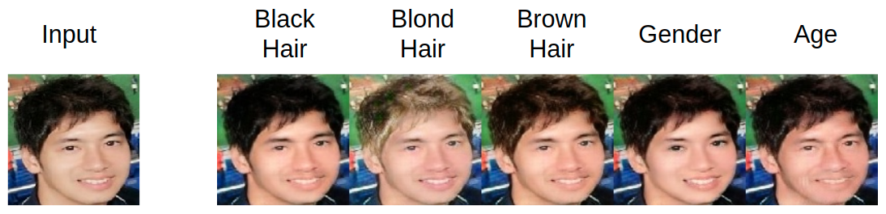

# StarGAN: Unified Generative Adversarial Networks for Multi-Domain Image-to-Image Translation



## TensorFlow Version
2.4

## Datasets
[CelebA](https://www.tensorflow.org/datasets/catalog/celeb_a)

## Prepare the Dataset
**coming soon**

## Train
~~If your GPU has Tensor Cores(compute capability 7.0 or higher), you can train the model as follows. Otherwise you need to set an option `--nouse_mp` to train.~~
```
python train.py
```

## Test
`test.ipynb` to test the model.<br>
You can test your own image changing the file path and the arguments shown in the picture below.<br>


## References
- Paper
  - [StarGAN: Unified Generative Adversarial Networks
for Multi-Domain Image-to-Image Translation](https://arxiv.org/abs/1711.09020)<br>

- Repos
  - https://github.com/yunjey/stargan<br>
  - https://github.com/timsainb/tensorflow2-generative-models<br>
  - https://github.com/tensorflow/models/tree/master/research/deeplab<br>

- Webpages
  - [TFRecord and tf.train.Example](https://www.tensorflow.org/tutorials/load_data/tfrecord)
  - [今さら聞けないGAN (5) WGAN-gpの実装](https://qiita.com/triwave33/items/72c7fceea2c6e48c8c07)

- Videos
  - [Inside TensorFlow: tf.data + tf.distribute](https://youtu.be/ZnukSLKEw34)
